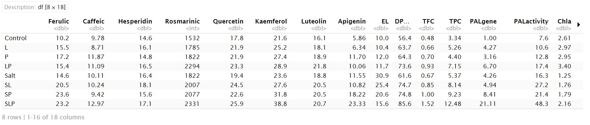
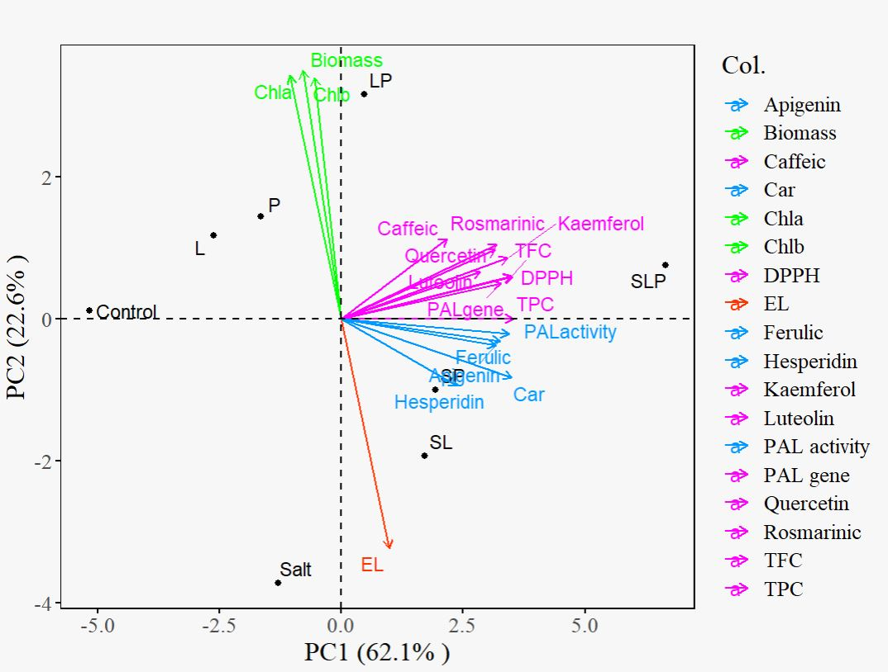
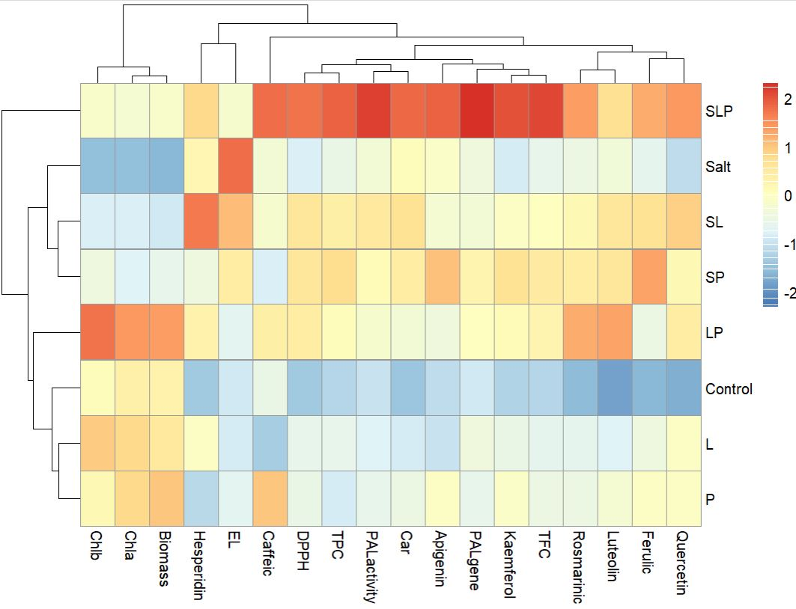
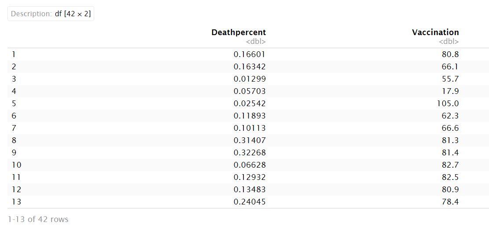
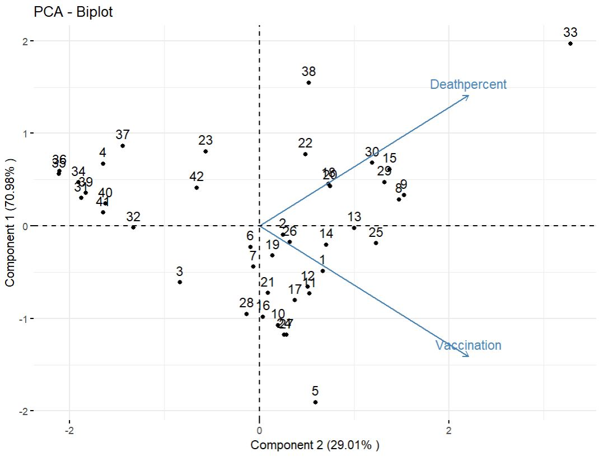
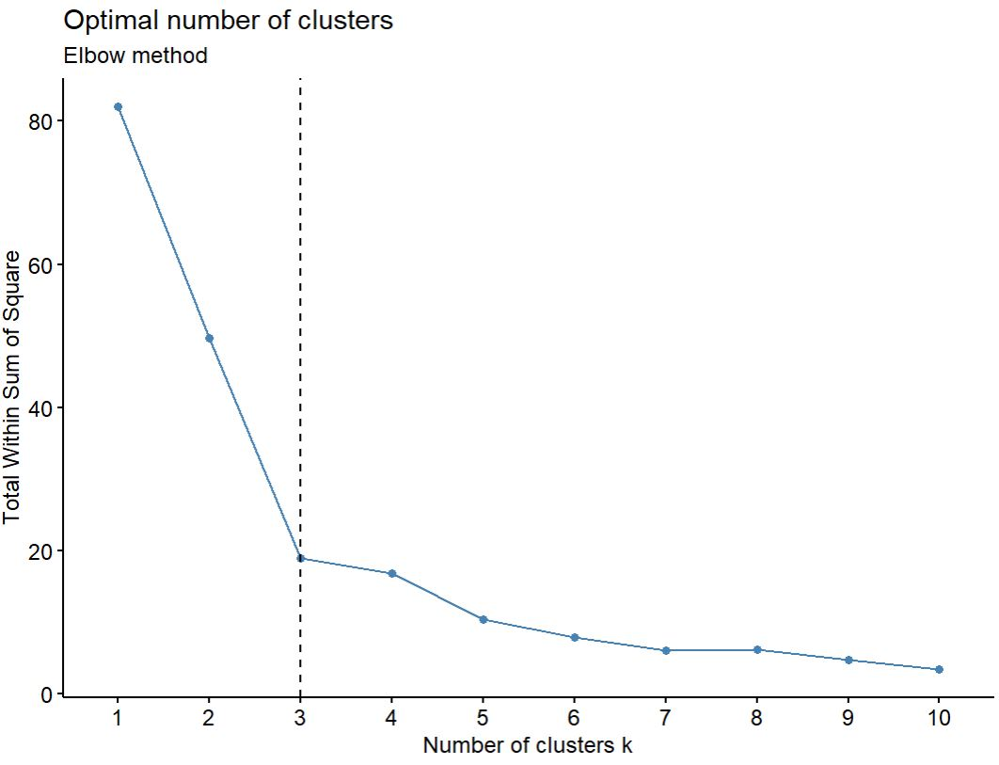
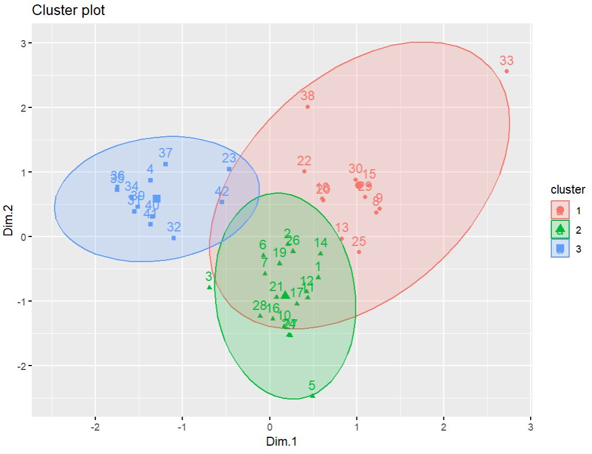

# Practical-examples-by-using-PCA
The objective of this repository is to outline a set of instructions for implementing principal component analysis (PCA) on practical real-world datasets. By following this comprehensive guide and applying PCA to diverse datasets, you have acquired the knowledge and skills to preprocess the data, execute the PCA methodology, and effectively interpret the outcomes. This approach can be expanded to encompass a wide range of publicly available datasets, enabling researchers and analysts to uncover valuable insights that may not be readily apparent in the original data.

## Table of contents
+ Overview
+ The steps of performing PCA 
+ Examples

### Overview
Principal Component Analysis is a widely utilized statistical method employed for reducing dimensionality and visualizing data. Its primary objective is to identify prominent patterns and correlations within high-dimensional datasets by transforming the original variables into a new set of uncorrelated variables known as principal components. By representing the data using the top two or three principal components, it becomes possible to plot the data points and gain insights into their distribution and patterns. 


Let's consider a scenario where we have $n$ observations with measurements on a set of $p$ features. PCA aims to discover a low-dimensional representation of the dataset that retains as much variation as possible. The underlying idea is that each of the $n$ observations exist in a $p$-dimensional space, but not all dimensions are equally informative. PCA seeks a small number of dimensions that capture the most interesting aspects, with interestingness measured by the amount of variability exhibited by the observations along each dimension.
Each principal component is a linear combination of the original variables and represents a specific direction in the data space. The first principal component is a linear combination of the primary predictors that captures the most variance in the dataset. It determines the direction of the greatest changes in the data. The larger the range of changes along the first component, the more information it contains. The second principal component is also a linear combination of the original predictors, capturing the remaining variance in the dataset while being uncorrelated with the first principal component.

### The steps of performing PCA

_Step 1. Load the Required Packages:_
Different packages are used in R for performing Principal Component Analysis (PCA) such as `stats`,  `FactoMine`, `FactoExtra`, `princurve`, …. Each package has its own set of functions and features, so you can choose the one that best suits your specific needs and preferences.  In addition, `ggplot2` package was used to visualize the results of PCA.
```{r}
library(FactoMineR)
library(factoextra)
library(ggplot2)
```
Further, we have employed the following packages to conduct more analyses.
```{r}
library(pheatmap)
library(extrafont)
library(ggtext)
library("readxl")
library(ggpubr)
```
_Step 2. Data Standardization:_ PCA begins by standardizing the dataset to ensure that all variables have zero mean and unit variance. This step is important because variables with larger scales can disproportionately influence the PCA results.

_Step 3. Conduct PCA:_
Here, we use  `FactoMineR` and `FactoExtra` packages which provide additional tools for enhancing the visualization and interpretation of PCA results. These packages offer functions for generating scree plots, biplots, and cluster analysis based on PCA.

_Step 4. Visualize PCA Results:_
*Biplots* are a valuable tool for visualizing relationships between variables and observations in multivariate datasets. They offer a concise graphical summary of the data's structure, providing insights that may not be readily apparent from the raw data alone. In a biplot, both the observations (data points) and variables (features) are represented within the same plot. The axes of the plot are defined by the principal components obtained from PCA. The data points are projected onto this reduced-dimensional space, indicating their positions.
The original variables are represented as vectors originating from the origin $(0,0)$ of the plot. These vectors' direction and length reflect the contribution and importance of the variables to the principal components. Variables pointing in the same direction indicate positive correlation, while those pointing in opposite directions suggest negative correlation. By examining the biplot, you can visualize relationships between observations and variables in the reduced-dimensional space. This visualization aids in understanding the data's structure, identifying patterns, and interpreting the principal components.

_Step 5. Interpretation of Results:_
When interpreting a biplot, several criteria can be considered to gain insights from the plot:
1. Proximity: Samples that are located close to each other on the biplot are highly similar, while those far apart exhibit negative correlation and substantial differences.
2. Feature correlation: Features that are grouped together on the biplot have a high correlation with each other. The proximity of these features to the main components indicates their importance. Features closer to the main components are more influential, while those farther away have less impact.
3. Sample and feature dominance: The proximity of a feature to a sample on the biplot reflects its dominance in describing that particular sample. For instance, samples located on the left side of the plot are primarily characterized by the features on the left side, indicating the dominance of those features. The same principle applies to samples and features positioned on the right or above the plot.
4. Explained variance: The percentage of explained variance associated with each principal component is important. A higher explained variance percentage indicates that the obtained information is more reliable. It signifies that the principal component captures a larger portion of the data's variability, making it a more influential factor in the analysis.
Considering these criteria when interpreting a biplot can help uncover meaningful patterns and relationships between samples and features in the reduced-dimensional space.

### Examples 
In the subsequent sections, practical examples from the author's conducted studies and published works are presented to delve deeper into the understanding of PCA. These examples serve to provide concrete illustrations of how PCA has been applied in real-world scenarios, allowing for a more comprehensive comprehension of its practical applications.

### Example 1: _Finding the association between variables and treatments via PCA_
In this example, PCA is performed to find the association between the different groups of treatments and variables measured in Salvia officinalis herb (Amooaghaie et. al. (2024)). The investigated variables are biomass, chlorophyll a (Chl a), chlorophyll b (Chl b), carotenoid (Car), PAL1 gene expression (PAL gene), and PAL activity, total phenol content (TPC), total flavonoid content (TFC), and antioxidant activity (DPPH) in S. officinalis. The treatments were included: control, seed priming with He–Ne irradiation (Laser), seed priming with H2O2 (peroxide), hybrid priming with laser and H2O2 (LP), salt, salt+laser (SL), salt+ H2O2 (SP), salt +laser +H2O2 (SLP).
```{r}
df<- data.frame(read.table("data//PCA//data3.txt"))
```

<!-- -->

_Performing PCA_
```{r, echo=FALSE}
df<-scale(df)
pca3 <- PCA(df)
pca3$eig
```
_Visualizing PCA Results_
```{r}
my.col.var <- c("#0099FF", "green", "#FF00FF", "#0099FF", "green", "green",
"#FF00FF", "#FF3300", "#0099FF", "#0099FF", "#FF00FF", "#FF00FF",
"#0099FF", "#FF00FF", "#FF00FF", "#FF00FF", "#FF00FF", "#FF00FF")

base_fig<- fviz_pca_biplot(pca3, repel = TRUE,  
ylab = paste0("PC2 (", 22.65, "% )" ),
xlab = paste0("PC1 (", 62.13, "% )" ),
geom = c("point", "text"),axes = c(1, 2), 
col.var = c("Ferulic","Caffeic","Hesperidin","Rosmarinic",
"Quercetin","Kaemferol", "Luteolin","Apigenin", 
"EL", "DPPH", "TFC", "TPC", 
"PAL gene", "PAL activity", "Chla", "Chlb", "Car", "Biomass")
,  title = "", palette = my.col.var)

windowsFonts(Times=windowsFont("Times New Roman"))

base_fig<- base_fig +
  theme(text = element_text(size=14))
base_fig<- base_fig +
            theme(text=element_text(family="Times", size=16))
base_fig<- base_fig+ theme(plot.background = element_rect(fill = "#f7f7f7"))
base_fig +  theme(panel.grid = element_blank(), 
        panel.border = element_rect(fill= "transparent"))
```


_Interpretation of Results_

The principal component analysis revealed that PCA 1 (62.13%) and PCA 2 (22.65%) accounted for the majority of the data variability. The biplot demonstrates that the predominant increase in EL is associated with the salt treatments. The variables ferulic, apigenin, total phenolic content (TPC), phenylalanine ammonia-lyase (PAL) activity, and carotenoids (Car) are closely linked to the SP treatment. Caffeic acid, rosmarinic acid, quercetin, kaempferol, 2,2-diphenyl-1-picrylhydrazyl (DPPH), total flavonoid content (TFC), and PAL gene expression are associated with the SLP treatment. Additionally, Chl a, Chl b, and biomass are increase due to the LP treatment.

### _Hierarchical clustering via pheatmap_
To support the results of pca, hierarchical clustering was performed using `pheatmap`. `pheatmap` is a powerful R package designed to generate heatmaps, which are visual representations of data matrices using color-coded values. These heatmaps are widely employed to visually analyze patterns, relationships, and clusters within datasets. One of the key features of pheatmap is its capability to perform hierarchical clustering on both rows and columns. This functionality aids in uncovering hidden patterns or groupings within the data, contributing to a more comprehensive understanding of the dataset. To enhance the findings from the PCA section and obtain a more holistic understanding of the dataset, we utilize the pheatmap function. This allows us to generate a heatmap that complements the results obtained from the PCA analysis, providing additional insights into the patterns and relationships within the data.
```{r}
pheatmap(df,scale = "column",clustering_distance_rows = "euclidean",
  clustering_distance_cols = "euclidean")
```

The heatmap analysis reveals distinct groupings among the treatments. The first cluster encompasses the combination of laser and H2O2 with salinity (SLP), which significantly increases the variables ferulic acid, caffeic acid, rosmarinic acid, quercetin, kaempferol, apigenin, DPPH, TFC, TPC, PAL gene expression, PAL activity, and carotenoid content. The second cluster pertains to the salt condition, which greatly enhances EL while negatively impacting Chla, Chlb, and biomass. The treatments involving laser and salinity (SL) and H2O2 and salinity (SP) are grouped in the subsequent cluster, displaying increasing trends in most variables. Conversely, the combination of laser and H2O2 (LP) significantly boosts Chla, Chlb, and biomass under non-saline conditions. Lastly, the individual applications of laser and H2O2 (Laser and Peroxide in the heatmap) are grouped together, mildly affecting the variables.

### Example 2: _Identifying patterns for vaccination and mortality rates across countries_
In this example, we will demonstrate how PCA can be applied to COVID-19 data to recognize patterns among different countries in terms of vaccination rates and number of deaths. We obtained the dataset from Our World in Data, containing information on COVID-19 cases, vaccinations, and deaths across multiple countries. The dataset covers a period from the beginning of the pandemic until the present time. We used the total vaccination doses administered and total deaths until 9 January 2023 reported for 42 countries and applied PCA to identify underlying patterns across countries. 

```{r}
df <- data.frame(read_excel("data//PCA//Covid19.xls", sheet = 2))
df <- subset (df, select = -Death)
ID<-df$ID
df <- df[,!colnames(df) %in% 'ID']
df1<-as.data.frame(ID)
```


_Performing PCA_
```{r}
df<-scale(df)
pca3 <- PCA(df)
pca3$eig
pca3$var$coord
fviz_pca_biplot(pca3, ylab = paste0("Component 2 (", 29.01, "% )" ),xlab = paste0("Component 1 (", 70.99, "% )" ))
```

  

###  _K-means clustering_ 
K-means clustering can be done on PCA results to group according to the smallest square of distance between points. It's a highly efficient and commonly used algorithm for partitioning data into clusters, providing a qualitative interpretation of the data by grouping similar conditions together. The algorithm calculates the similarity and dissimilarity among observations to determine cluster assignments. 
An important aspect of this algorithm is the selection of the desired number of clusters, denoted as *k*. Several methods and heuristics exist to estimate the optimal number of clusters, such as the `elbow method` or `silhouette analysis`. The elbow method is a simple and intuitive technique that serves as a starting point for determining the optimal number of clusters in K-means clustering. This method relies on the observation that as the number of clusters increases, the within-cluster sum of squares (WCSS) typically decreases, as it measures the total distance between data points and their assigned cluster centroids. However, the decrease becomes less significant when the number of clusters becomes too large. To implement the elbow method, a range of values for *k* is chosen, starting with a small number and gradually increasing it. For each value of *k*, the K-means clustering algorithm is run, and the WCSS is calculated. A plot is then created with the number of clusters on the x-axis and the WCSS on the y-axis, often referred to as the elbow plot. The point on the plot where the WCSS starts to decrease at a slower rate is considered the elbow of the plot. The corresponding value of *k* at this point is considered the optimal number of clusters.
  
```{r}
fviz_nbclust(df, kmeans, method = "wss") +
  geom_vline(xintercept = 3, linetype = 2)+
  labs(subtitle = "Elbow method")
```


  
The elbow analysis indicates that three clusters may be suitable for representing the data.
  
```{r}
# Performing K-means clustering
df<-scale(df)
res.km <- kmeans(df, 3, nstart = 25)
res.pca <- PCA(df)
ind.coord <- as.data.frame(get_pca_ind(res.pca)$coord)
df1$cluster<-factor(res.km$cluster)
# Add clusters obtained using the K-means algorithm
ind.coord$cluster <- factor(res.km$cluster)
km.res <- kmeans(ind.coord, 3, nstart = 25)
km.res$cluster
data1 <- get_pca_ind(res.pca)$coord
# visualizing the results
fviz_cluster(km.res, data1, ellipse.type = "norm")
```
  
  
Our analysis revealed distinct clusters of countries based on their vaccination and mortality rates. Some countries such as Qatar, Australia, South Korea, and Norway exhibited high vaccination rates coupled with low mortality rates, indicating successful containment of the virus through vaccination efforts. Conversely, some countries (Peru, Brazil, Greece, Italy and France) showed a concerning trend of high mortality rates despite vaccination efforts, highlighting potential challenges in healthcare infrastructure or vaccine effectiveness. The third group includes countries with low vaccination and mortality rates, such as Congo and Afghanistan. The very low number of deaths in this group may be due to inaccurate information reported by these countries. In conclusion, PCA and k-means clustering provide valuable insights into the complex dynamics of COVID-19 data by identifying patterns and relationships among different countries. By understanding these patterns, policymakers and public health officials can tailor interventions and allocate resources more effectively to combat the pandemic.

### References

[1] Gareth James, Daniela Witten, Trevor Hastie, Robert Tibshirani, (2013). An introduction to statistical learning : with applications in R. New York :Springer.

[2] Rayhaneh Amooaghaie, Fatemeh Mardani Korrani, Mustafa Ghanadian, Alimohammad Ahadi, Abbas Pak & Gashtasb Mardani, (2024).  Hybrid Priming with He–Ne Laser and Hydrogen Peroxide Advances Phenolic Composition and Antioxidant Quality of Salvia officinalis Under Saline and Non-Saline Condition. *J Plant Growth Regul*, 43, 1012–1025. 

[3] Edouard Mathieu, Hannah Ritchie, Lucas Rodés-Guirao, Cameron Appel, Charlie Giattino, Joe Hasell, Bobbie Macdonald, Saloni Dattani, Diana Beltekian, Esteban Ortiz-Ospina and Max Roser (2020) - "Coronavirus Pandemic (COVID-19)". Published online at OurWorldInData.org. Retrieved from: 'https://ourworldindata.org/coronavirus' [Online Resource]
